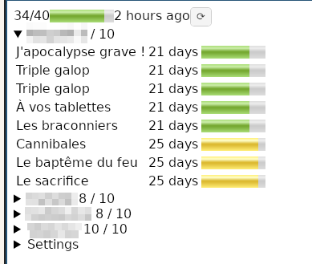

A command line too to get the list of loans on Saint-Paul bibliotheque.

In summary, this is a limited access to https://mediatheques-saintpaul.re, for
multiple account, allowing to list your books and how much time you can keep
them.

With a bit of setup, it should also work for any "Iguana" based library website, look for `iguana_root` in the code.

# Features:

- Automated login process for multiple accounts
- Recover the list of book and how much time you can keep them

# Usage:

Fill the `credentials.json` file as such:

```json
[
  {
    "user": "X00000000001",
    "password": "01010101",
    "name": "displayname1"
  },
  {
    "user": "X000000002",
    "password": "02020202",
    "name": "displayname2"
  }
]
```

Then run the executable (with `--refresh`). You can do that with nix:

```
# With nix, takes care of everything
nix run .# -- --refresh`

# with cabal
cabal run -- --refresh
```

The `--refresh` flag can be ignored on future run unless you want to refresh the listing.


# Android UI

- Build the UI with: `nix build --impure .\#ui.android.st-paul-books`
- Deploy with `./result/bin/deploy` (if phone connect with `adb`) or just download the APK on the phone.




You will need to enter the `credential.json` file content into the `Settings` panel.

# Future development

- Automatic time extension for book close to the delay
- Split auth and query, so we can reuse already authenticated users.
