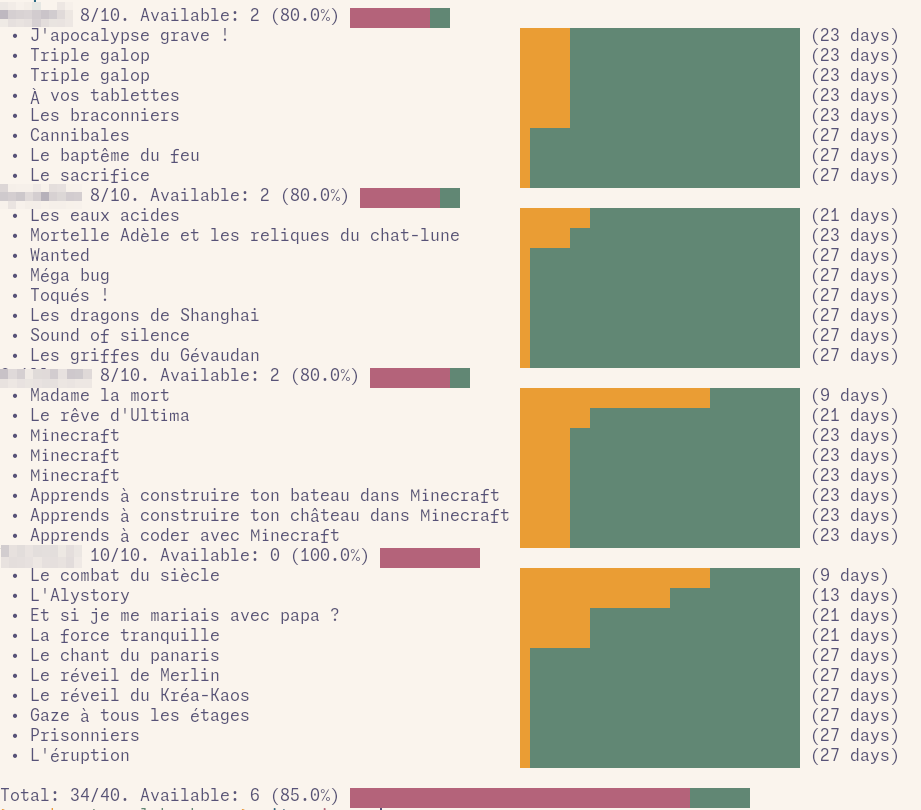

A command line too to get the list of loans on Saint-Paul bibliotheque.

In summary, this is a limited access to https://mediatheques-saintpaul.re, for
multiple account, allowing to list your books and how much time you can keep
them.

With a bit of setup, it should also work for any "Iguana" based library website, look for `iguana_root` in the code.

# Features:

- Automated login process for multiple accounts
- Recover the list of book and how much time you can keep them

# Usage:

Fill the `credentials.json` file as such:

```json
[
  {
    "user": "X00000000001",
    "password": "01010101",
    "name": "displayname1"
  },
  {
    "user": "X000000002",
    "password": "02020202",
    "name": "displayname2"
  }
]
```

Then (in the `nix develop` shell), run:

```sh
# (Optional) refresh book listing
runhaskell ./Refresh.hs

runhaskell ./Summerize.hs
```



# Future development

- Automatic time extension for book close to the delay
- Advanced UI (possibly for phone)
